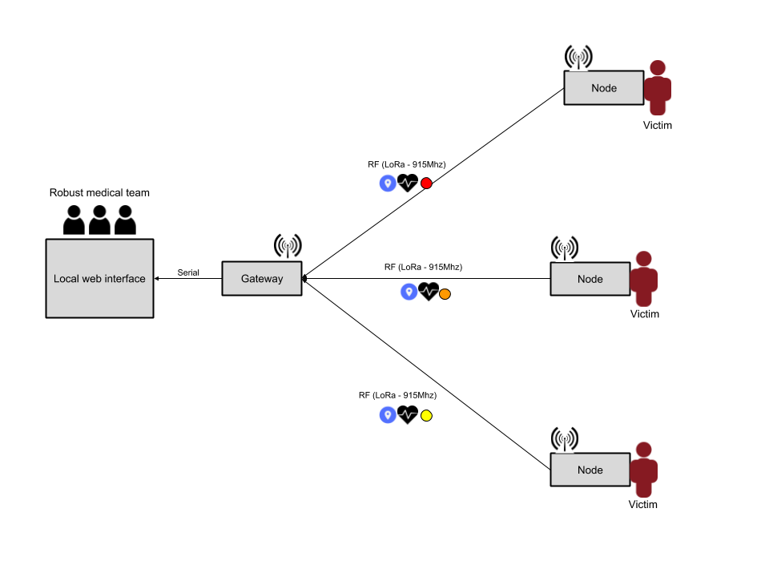

# pivotal-software
A pivotal approach to graduating

## Installation Mongo

### Mac
https://treehouse.github.io/installation-guides/mac/mongo-mac.html

### Windows
https://docs.mongodb.com/v3.2/tutorial/install-mongodb-on-windows/

### Linux
https://docs.mongodb.com/manual/administration/install-on-linux/

### Install UI
```
cd client
```

```
npm install
```

## Running Instructions
```
chmod +x run.sh
```

Connect the gateway to the computer and then run ``./run.sh``
Note: If you do not connect the gateway before running the bash script to start the software, the system will fail.

```
./run.sh
```


